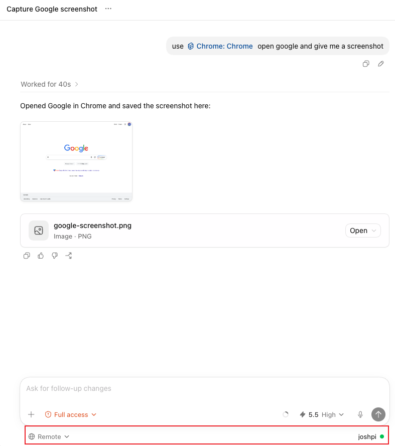

# codex-browser-use-linux-chromium

Unofficial compatibility layer for using Codex Browser Use / Chrome skill with
Chromium on Linux remote hosts.

This project does not redistribute the official Codex desktop app, official
Chrome extension, or official Browser Use plugin. It only installs Linux-side
compatibility files and small local patches so a Linux Chromium host can satisfy
the runtime shape expected by the official Codex Chrome/Browser Use skill.



## What It Does

- Installs a Linux native-messaging bridge for the official Codex Chrome
  extension.
- Installs a minimal `node_repl` MCP server exposing `js` and `js_reset`.
- Exposes `nodeRepl` and `__codexNativePipe` so the official
  `browser-client.mjs` can connect to Chromium through the native host.
- Provides `nodeRepl.import()` and `__dynamicImport()` for relative imports
  resolved from the REPL cwd.
- Saves emitted browser images to absolute files under the current workspace
  and prints a Markdown image link, so Codex Desktop can render screenshot
  deliverables as visible file artifacts.
- Accepts the official Node REPL `js` call shape, including optional `title`
  and per-call `timeout_ms`/`timeoutMs` fields.
- Adds Browser client CDP call timeouts around page-level operations such as
  screenshot capture and DOM snapshots, so Chromium-side hangs return a
  recoverable error instead of stalling the MCP call until the outer tool
  transport closes.
- On Linux Chromium, uses a faster visible-viewport screenshot path that lets
  Chromium capture the current viewport directly instead of first computing a
  layout clip rectangle. Screenshot capture remains a supported first-class
  operation.
- Cleans up native browser sockets after a `js` timeout, so a timed-out browser
  command is less likely to poison follow-up tool calls in the same MCP process.
- Restarts the native host bridge when a client disconnects with an in-flight
  browser command, which clears orphaned screenshot/DOM commands that can later
  surface as `Detached while handling command`.
- Adds skill guidance so agents stop retrying the same page-level browser
  operation after repeated `tab.playwright` / `tab.cua` / input timeouts.
- Gives each MCP process a unique Browser Use `session_id` and stable
  process-scoped `turn_id`, matching the isolation the official desktop runtime
  normally provides for browser-session state.
- Patches locally cached Codex Browser Use / Chrome plugin scripts so they
  recognize Chromium on Linux.
- Patches plugin-local `mcpServers` metadata for both Chrome and Browser Use,
  so Codex CLI 0.130+ plugin caches expose the selected plugin version's MCP
  entry instead of depending on a global or stale MCP entry. Chrome keeps the
  official `node_repl` name; Browser Use is renamed to `browser_node_repl` to
  avoid Codex's duplicate plugin MCP server-name de-duplication.
- On Linux, patches the official `Browser` / `browser-use` skill to keep the
  `@browser` entrypoint but select the Chromium-backed `extension` backend.
  Linux remote hosts do not have the Codex Desktop `iab` browser, and treating
  the extension as `iab` is not equivalent for screenshot-heavy flows.
- Optionally installs macOS Desktop remote path shims under `/Applications/...`
  on the Linux host. This is needed when Codex Desktop on macOS remotely
  connects to the Linux host and sends its own `node_repl` path through
  `RefreshMcpServers`.
- Optionally installs Windows Desktop remote path shims for common Codex and
  Codex Beta install paths under `AppData\\Local\\Programs`. This is needed
  when Codex Desktop on Windows sends a Windows-local `node_repl.exe` command
  to the Linux app-server.

## Security and Approval Model

This compatibility layer runs in trusted local mode by default. Browser Use
approval is effectively `allow`: navigation, browser history access, downloads,
and uploads are not connected to the Codex Desktop approval prompts.

The Linux `node_repl` runtime intentionally sets:

```text
x-codex-browser-use-security-mode: disabled-for-local-testing
```

and its `createElicitation()` helper currently auto-accepts approval requests.
This matches the practical behavior of "Always allow", but it is not the same
as integrating with the Codex Desktop settings page under
`Computer use > Google Chrome`.

The Codex Desktop approval UI, allowed/blocked domain lists, and per-feature
history/download/upload settings are owned by the closed-source desktop app and
are not exposed to this Linux remote runtime. Use this project only on hosts,
browser profiles, and network environments you trust. A future local policy file
could add project-owned allow/deny checks, but it would not be synchronized with
the official desktop approval UI.

## Requirements

- Linux host with Node.js 20+.
- Chromium installed as `chromium` or `chromium-browser`.
- The official Codex Chrome extension already installed or loaded in Chromium.
- Codex CLI/app-server already set up on the Linux host.
- A cached official Codex Chrome plugin under `~/.codex/plugins/cache/...`.

The default extension ID used by this installer is:

```text
hehggadaopoacecdllhhajmbjkdcmajg
```

Override it with `--extension-id` if your extension ID differs.

## Install

From the project directory on the Linux host:

```bash
node bin/codex-browser-use-linux-chromium.js install --desktop-shims --windows-shims
node bin/codex-browser-use-linux-chromium.js doctor
```

`install` performs these steps:

- Copies runtime files into
  `~/.local/share/codex-browser-use-linux-chromium`.
- Writes user-level Chromium and Google Chrome native host manifests.
  Use `--system-native-host` when Chromium already has a system manifest under
  `/etc/chromium/native-messaging-hosts` or Chrome has one under
  `/etc/opt/chrome/native-messaging-hosts`.
- Patches discovered official Browser Use / Chrome plugin caches and Codex
  0.130 staged bundled-marketplace plugin roots under
  `~/.codex/.tmp/bundled-marketplaces/...`. Plugin patching is planned
  transactionally per plugin root: if any required patch point is missing, that
  plugin root is left untouched.
- Updates or creates plugin-local `.mcp.json` entries pointing to the installed
  runtime. Chrome plugin roots use `node_repl`; Browser Use plugin roots use
  `browser_node_repl`. The installer also adds `mcpServers` metadata to Chrome
  and Browser Use plugin manifests when the official cache does not ship it.
- Enables `features.tool_search_always_defer_mcp_tools = true` in
  `~/.codex/config.toml` so Codex 0.130+ exposes plugin MCP tools such as
  `node_repl/js` through `tool_search`. Pass `--skip-feature-config` only if
  you want to manage that feature flag yourself.
- With `--desktop-shims`, creates Linux shims for macOS Codex Desktop remote
  paths:
  - `/Applications/Codex.app/Contents/Resources/node_repl`
  - `/Applications/Codex (Beta).app/Contents/Resources/node_repl`
- With `--windows-shims`, creates Linux shims for common Windows Codex Desktop
  remote paths, including stable and Beta paths under
  `C:\\Users\\<name>\\AppData\\Local\\Programs\\...\\resources\\node_repl.exe`.
  The installer generates both the local Linux username and a capitalized
  variant; pass `--windows-username NAME` when the Windows account name differs.
  Backslash-form Windows commands are installed into both `~/.local/bin` and
  `~/.npm-global/bin`, so the app-server can find them through PATH.
- With `--system-native-host`, writes system native host manifests:
  - `/etc/chromium/native-messaging-hosts/com.openai.codexextension.json`
  - `/etc/opt/chrome/native-messaging-hosts/com.openai.codexextension.json`

The `/Applications` shims and system native host manifests require root
permissions. The installer preflights passwordless `sudo -n` before making
changes when either privileged option is requested.

For tests or custom Chromium profile locations, override the manifest root:

```bash
node bin/codex-browser-use-linux-chromium.js install --browser-config-root /tmp/browser-config
```

The installer refuses real writes on non-Linux hosts unless
`--allow-non-linux` is passed. Use that only for local tests with temporary
directories.

## Optional Codex CLI Config

The installer always enables this Codex 0.130+ compatibility flag unless
`--skip-feature-config` is passed:

```toml
[features]
tool_search_always_defer_mcp_tools = true
```

Without it, `node_repl` can be registered as a direct MCP tool but absent from
`tool_search`, which makes Chrome/Browser skills report that no JS tool is
available even though `codex mcp list` shows the server.

Codex 0.130 also de-duplicates plugin MCP servers by name. If both the Chrome
and Browser Use plugin caches declare `node_repl`, the first loaded plugin can
claim the name and the other plugin's JS tool may not be discoverable in a
desktop remote conversation. This installer avoids that collision by keeping
Chrome on `node_repl` and moving Browser Use to `browser_node_repl`. The patched
Browser skill knows to search for `browser_node_repl js` when `node_repl/js` is
not visible.

The patched Chrome skill is deliberately stricter: Chrome tasks should use
`node_repl`, not `browser_node_repl`. The latter exists only for Browser /
in-app-browser compatibility and can lead a Chrome request down Browser-specific
routing instructions.

For direct Codex CLI usage, also add:

```bash
node bin/codex-browser-use-linux-chromium.js install --write-codex-config
```

This appends a marked `node_repl` MCP block to `~/.codex/config.toml` if no
`[mcp_servers.node_repl]` block exists. If the block already points at a known
older `codex-chrome-extension` or `codex-browser-use-linux-chromium` REPL path,
the installer updates it to the current runtime path. Custom `node_repl`
entries are left unchanged.

Codex Desktop remote sessions may still override MCP config via
`RefreshMcpServers`; the desktop path shims are what handle that case.

## Windows Desktop Clients

Windows Codex Desktop may send a Windows-local `node_repl` command path through
`RefreshMcpServers`, for example a path under `AppData\\Local\\Programs`.
That path varies by Windows username and install channel. Install the common
Windows stable/Beta shims with:

```bash
node bin/codex-browser-use-linux-chromium.js install --windows-shims --windows-username YOUR_WINDOWS_USER
```

If the Windows username matches the Linux username, `--windows-username` is not
needed. The generated shims cover both backslash commands like:

```text
C:\Users\Josh\AppData\Local\Programs\Codex Beta\resources\node_repl.exe
```

and forward-slash variants like `C:/Users/Josh/.../node_repl.exe`. If Codex
Desktop uses a custom install path, inspect the Linux host app-server log for
the exact `RefreshMcpServers` `node_repl.command` value and pass it explicitly:

```bash
node bin/codex-browser-use-linux-chromium.js install --windows-shims \
  --windows-node-repl-path 'C:\Users\Josh\AppData\Local\Programs\Custom Codex\resources\node_repl.exe'
```

## Restore Plugin Patches

Plugin patches are backed up next to each patched file with a
`.codex-browser-use-linux-chromium.bak.<timestamp>` suffix.

Restore the latest adjacent backups with:

```bash
node bin/codex-browser-use-linux-chromium.js restore-plugin
```

## Debugging

Useful logs on the Linux host:

```text
/tmp/codex-native-host-bridge.log
/tmp/codex-node-repl-mcp.log
~/.codex/logs_2.sqlite
```

If a fresh Codex Desktop conversation cannot see `mcp__node_repl__js`, search
`logs_2.sqlite` for `RefreshMcpServers` and verify the exact `node_repl.command`
exists on the Linux host. Also search the logs for `skipping duplicate plugin
MCP server name`: if Chrome and Browser Use both declare `node_repl`, reinstall
this compatibility layer so Browser Use is moved to `browser_node_repl`, then
restart `codex app-server`. On Codex 0.130 remote hosts, verify both
`~/.codex/plugins/cache/...` and
`~/.codex/.tmp/bundled-marketplaces/openai-bundled/plugins/...`; the staged
bundled-marketplace copy is what some Desktop remote turns load.

If `mcp__node_repl__js` appears to hang, check for old
`codex-node-repl-mcp.js` processes and open connections in
`/tmp/codex-native-host-bridge.log`. Each MCP process should log a distinct
`session_id` and a stable `turn_id` in `/tmp/codex-node-repl-mcp.log`. The
JavaScript tool has a default 100 second timeout; override it with
`CODEX_NODE_REPL_JS_TIMEOUT_MS=0` to disable the timeout or another millisecond
value to tune it. The `js` tool also accepts per-call `timeout_ms`/`timeoutMs`
values, matching the official runtime's call shape. A timeout returns an MCP
error but keeps the stdio transport open, so follow-up calls such as `js_reset`
can still recover the session. By default the runtime destroys native browser
pipe connections and resets the JS context after a timeout; set
`CODEX_NODE_REPL_RESET_ON_TIMEOUT=0` only if you need to preserve in-memory JS
state across timeouts. Set `CODEX_NODE_REPL_EXIT_ON_TIMEOUT=1` only if you
explicitly want timeout errors to terminate the MCP process.

The timeout error includes a `consecutive_js_timeouts` counter and recovery
hint. `domSnapshot()` and screenshot capture are normal supported Browser Use
features on Linux Chromium; the compatibility layer should not steer agents to
silently avoid them. If lightweight calls such as `browser.tabs.list()`,
`tab.url()`, and `tab.title()` still work while `domSnapshot`, screenshot,
click, fill, or keyboard calls keep timing out, treat it as a page-level
browser bridge hang. Run `js_reset`, re-bootstrap, create a new tab, navigate to
the target URL again, and retry the requested evidence in a fresh single-purpose
call. Do not recover by finding an existing tab with the same URL after a bridge
reset; that tab may still be tied to an orphaned CDP command. If it still fails,
report that page-level blocker instead of claiming the screenshot or DOM feature
is unavailable.

On Linux Chromium, keep browser bridge calls short and single-purpose. Do not
combine click/fill/keyboard/navigation with `domSnapshot()`, screenshots, dev
logs, or per-element extraction loops in one `js` call. Run the interaction,
then verify in a fresh follow-up call. Use screenshots for visual evidence and
`domSnapshot()` when a full accessibility snapshot is the right evidence; use a
compact targeted `evaluate` only when the task does not need the full tree. If a
call fails with `native pipe is closed`, `Detached while handling command`, or
`Timed out after ... waiting for CDP command`, the REPL resets its stale browser
context by default; run `js_reset`, re-bootstrap, create a new tab, and navigate
to the target URL again before retrying.

If `/tmp/codex-native-host-bridge.log` contains repeated `stdout backpressure`
lines, the native host is sending commands to Chromium faster than Chromium is
reading them. This version serializes native-host stdout writes and waits for
`drain` before sending more frames. You can lower the fail-fast queue cap with
`CODEX_NATIVE_HOST_MAX_CHROME_QUEUE_BYTES`; the default is 64 MiB.

When a REPL timeout disconnects while a browser command is still pending, the
native host bridge exits by default so Chromium restarts it with a clean command
pipe. This prevents orphaned screenshot or DOM commands from causing later
`Detached while handling command` failures. Set
`CODEX_NATIVE_HOST_EXIT_ON_ORPHANED_PENDING=0` to preserve the old behavior.

If a screenshot task says it succeeded but no image appears in the final
assistant message, check whether the final message references
`attachment://response_0.png`. The screenshot usually did arrive as a previous
tool-output image; that attachment URI is not stable in this compatibility
runtime. The installer patches the Chrome skill to keep the screenshot image in
the latest browser tool output, save it to a workspace file, and avoid synthetic
attachment links. The REPL also replays the most recent emitted image when a
follow-up `js` call only finalizes browser tabs, covering the common
cleanup-after-screenshot ordering mistake.

`doctor` also reports Browser Use sockets under `/tmp/codex-browser-use`.
Sockets whose owner process is gone are stale; the native bridge removes stale
`chromium-<pid>.sock` files on startup.

See [docs/architecture.md](docs/architecture.md) for the runtime flow.
